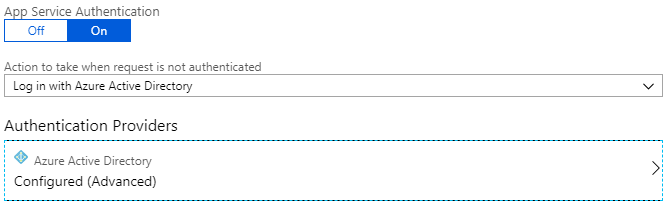
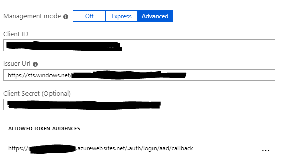
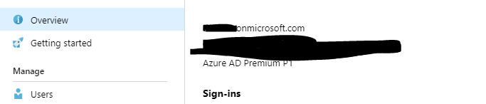

# Portal

This is a online portal that is intended to be used to:
- Share articles with users.
- Share documents.
- Display calendar events.
- Directory lookup showing users, phone numbers, email addresses... etc

## Getting Started

### Prerequisites
This project is a dotnet core web application that utilises various functionality that is provided by Microsoft Azure cloud platform. It is recommended that you have the following:
- dotnet core ^2.0.
- Webpack, Node JS, NPM.
- Azure Active Directory.
- Azure Storage Account; Blob store for documents.
- SQL Database.
- Azure WebApp.

### App Registration
You will first need to register a web app in azure. You can do this by Logging into the azure portal and clicking "Create a resource" then search for "Web App". Follow the instructions on screen to create the web application.

### Authentication
Once the web app has been created, we can secure access to this web app by creating an authentication layer on it. Azure makes this nice and easy. Just go to the web app in "App Services" and click on "Authentication / Authorization" then match the settings shown below



When configuring the "Azure Active Directory" Authentication Provider, first create it using express mode. Then change it to advance mode. You'll need the client secret a little later so make a note of it. Also fill in a reply URL. It should be ```https://[webappname].azurewebsites.net/.auth/login/aad/callback```
or if you have a custom domain
```https://[domain]/.auth/login/aad/callback```




In the project you will find an appsettings.json file. This will need to be configured to connect to your active directory.

```
  "AzureAd": {
    "Instance": "https://login.microsoftonline.com/",
    "Domain": "[DOMAIN].onmicrosoft.com",
    "ClientId": "[CLIENT_ID]",
    "TenantId": "[TENANT_ID]",
    "ClientSecret": "[CLIENT_SECRET]"
  }
```
The domain is the name of your tenant. It can be found on the "Azure Active Directory" overview page. It should end with onmicrosoft.com:



The **ClientId** is also referred to "ApplicationId". This can be found on the azure portal: Azure Active Directory > App Registration > [Choose your App] > ApplicationId.

Your **TenantId** - Also known as DirectoryId - can be found by navigating to: Azure Active Directory > Properties. On this page you will see a field called DirectoryId. Use this value as your TenantId.

Finally, the **ClientSecret** can be generated by navigating to Azure Active Directory > App Registration > [Choose your App] > Settings > Keys. Now enter a "Key description" and duration for the key. Once the values have been entered/chosen, then a random value will appear. Copy this and use it as the ClientSecret.


## Roles

### Defining Roles
Your web app will require one role to be added. This is the author role. Every user will default to user role, but authors should be allowed to create news articles.

```
"appRoles": [
    {
      "allowedMemberTypes": [
        "User"
      ],
      "displayName": "Author",
      "id": "[GUID]",
      "isEnabled": true,
      "description": "Authors can create articles",
      "value": "Author"
    }
  ]
```

You can create a random GUID from various tools available online.

### Assigning Roles

Now that roles have been created, you can assign the new author role to users. To do this, navigate to Azure Active Directory > Enterprise Application > [App name] > Users and Groups.

On this page you can add a user and assign a role to the user.

## Permissions
The portal app will require several permissions from the Microsoft Graph which are listed below. The easiest way to grant these permissions is to go to Azure Active Directory > App Registrations (Preview) > [App name] > API Permissions. Now click on Add permissions > Microsoft Graph and add the following:
- Application Permissions
-- Calendars.Read
-- Contacts.Read
-- Groups.Read.All
-- Users.Read.All

- Delegate Permissions
-- openid
-- profile

Now that the permissions have been requested, click on **Gran admin consent for ...** at the bottom of the API Permissions screen.

### Database / Blob Storage
The portal has two main storage areas. An SQL database and a blob store.
The SQL database is used to store the article data and the blob store is used to hold the documents.

Change the following in the appsettings.json file.
```
"ConnectionStrings": {
    "PortalDatabase": "[Connection string from azure]",
    "BlobStorage": "[Blob store connection string from azure]"
  },
```

If you have a SQL Database setup in azure, then you can find the connection string here: All Services > SQL Database > [Database name] > Overview.
Here you will see a link that says, "Show database connection strings". Click this and copy the connection string.

The connection string for the blob storage can be found at the following location: All Services > Storage Accounts > [Name of storage] > Access Key. Copy the key1 or key2 connection string.


### Shared Calendar
The shared calendar currently works by creating a shared mailbox in Azure Active Directory. This mailbox would be mounted onto the admins outlook and when they add a new appointment/meeting/event to the outlook calendar, this will become visible on the portal too.

In the appsettings.json file replace the following:
```
  "GroupCalendarId": "[GroupId]",
  "SharedCalendar": "[Shared mailbox email address]",
  "UseSharedCalendar":  true 
```
All you need is the shared mailbox email address to get the calendar to function correctly.
At first, we was looking to set up a group calendar and use this to show events on the portal. We had trouble with permissions. We only wanted to have a particular user to have permissions to write to a calendar and everyone have read permissions. The group calendar did not allow this as the Microsoft Graph API currently only supports delegate access to the group calendar. Also, every user that should be allowed access to read the calendar would need to be added to the group but then they would have read and write access to the group, hence why we opted for the Shared Mailbox approach. The code for Group Calendars has been left as we hope Microsoft will allow applications permissions to read from the group calendar.

## Build Project
To build the entire project you can either open the solution in visual studio or run:
```
  dotnet build ./Portal.sln
```

Don't forget to restore the nuget and npm packages.

## Deployment

When deploying this portal to an azure website, just right click on the Portal.Website project inside of visual studio and click publish. A window will appear saying to connect to Azure. Connect and choose your azure website to deploy too.

## License

## Acknowledgments
Calendar - FullCalendar.io
